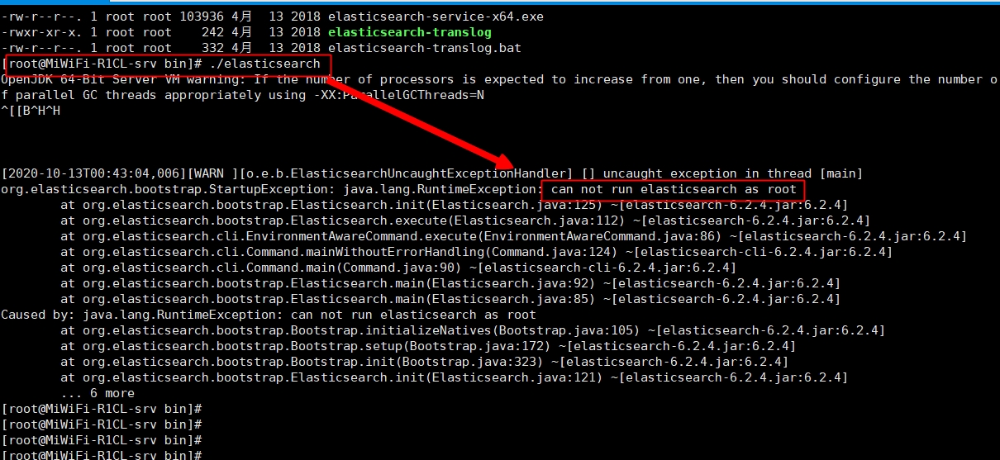

# ES学习笔记

### 一、安装ElasticSearch 6.2.4
- 1.官网下载ES
```xml
https://www.elastic.co/cn/downloads/past-releases/elasticsearch-6-2-4
```
- 2.上传ES压缩包并解压

```xml
1) 上传到 /home/software
2) 解压缩包 :  tar -zxvf xxx.tar.gz
3) 移动解压后的文件 ：mv xxx /usr/local
4) ES目录介绍：
    bin: es启动脚本
    config: elasticsearch.yml核心配置文件
    logs:
    plugins:
    data: 

```
- 3.启动并测试

进入bin ./elasticsearch 

==> 启动会出现错误，原因elasticsearch默认不能以root用户启动



==> 安装包上传给普通用户（root用户家目录是：/root ；普通用户的家目录时：/home/username）

==> 执行第2个步骤（解压）

==> 测试成功 "curl http://localhost:9200"
 

```xml
创建用户：
    groupadd es  //创建用户组
    useradd muyer -g es //在es这个用户组里创建用户muyer
    password muyer 修改的密码
测试指令：    
    curl url 请求
    wget url 下载资源
```

- 4.开启es远程连接权限并测试（ES默认是只能本地访问）

1）修改elasticsearch.yml文件： network.host: 0.0.0.0
2）改完启动服务，报三个错误
3）解决错误
4）重新启动，外部浏览器访问：http://xx.xx.xx.xx:9200/

- 5.修改jvm.optins内存大小
```xml
-Xms512m
-Xmx512m
注意：最小就是512m
```
### 二、安装Kibana 6.2.4

- 1.官网下载
```xml
https://www.elastic.co/cn/downloads/past-releases#kibana

kibana-6.2.4-x86_64.rpm

```

### 三、IK分词器安装并且使用

### 四、ES简介、原理

### 五、ES基本操作

- 1.索引操作

```xml
创建索引（注意名字必须全部小写）：
    PUT /indexname  
查看索引：   
    单个索引：GET /indexname
    全部索引：GET/_cat/indices?v
删除索引：
    单个索引：DELETE /indexname
    所有索引：DELETE /*

```

- 2.创建索引、类型、映射

```xml
PUT /indexname{
    "mappings":{
        "typename":{
            "properties":{
                "id":{"type":"keyword"}
                "age":{"type":"integer"}
            }
        }
    }
}
```
- 3.查看索引类型和映射

```xml
GET /indexname/_mapping
```
- 4.文档操作
```xml
添加文档：
    PUT /indexname/type/手动输入id{k:v}
查询文档
更新文档
    POST /indexname/type/id/_update{
        "doc":{
            需要更新的字段
        }
    }
    
    POST /indexname/type/手动输入id/_update{
        "script":ctx_source.文档的字段(类型integer) + = 1
    }

删除文档
    DELETE /indexname/type/_id
    
批量操作（每一个都是独立的）
    POST /index/type/_bulk{
        "index":{},
        "update":{},
        "delete":{},
        ...
    }

```

### 六、ES高级搜索
- 1.URL（query String as parameter）

```xml
GET /index/type/_search?q=*&sort=age:desc&size=2&from=1
sort=age:desc 排序
size=2&from=(当前页-1)*分页

```

- 2.DSL（Request Body方式） 推荐使用，特殊领域查询语言

1）全查+条件
```xml
GET /index/type/_search{
    //查询所有
    "query":{
        "match_all":{
        
        }
    },
    //指定条数
    "size":4,
    //分页
    "from":2,
    //排序
    "sort":[{}],
    //返回指定字段
    "_source":["k1","k2"]
}

```
2）关键字查询（term查询）
```xml
"query":{
    "term":{
        "content":{
            "value":"好人"
        }
    }
}
```

3）范围查询(range)
```xml
"query":{
    "range":{
        "age":{
            "gte/gt":1,"lte/lt":10
        }
    }
}
```

4）前缀查询(prefix)
```xml
"query":{
    "prefix":{
        "content":{
            "value":"spring"
        }
    }
}
```
5）通配符查询(wildcard)

```xml
*任意多个字符；?一个任意字符

"query":{
    "wildcard":{
        "name":{
            "valule":"叶?"
        }
    }
}

```
6）多id查询(ids)

```xml
"query":{
    "ids":{
        "values":[
            "",""
        ]
    }
}
```

7）模糊查询(fuzzy)
```xml
允许错误在0-2最大距离

"query":{
    "fuzzy":{
        "name":"叶大江"
    }
}

```
8）布尔查询（bool：must/should/must_not）
```xml
"query":{
    "bool":{
        "must":[{"term":{}},{}],
        "must":[{"ids":{}},{}],
    }
}
```

9）多字段查询

10）多字段分词查询


### 七、JavaSe操作ES

### 八、Springboot操作ES