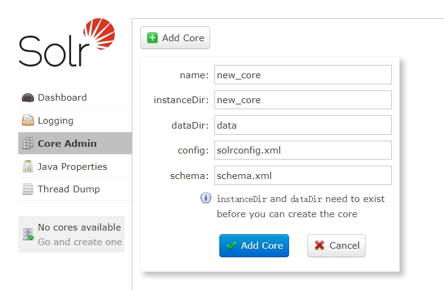
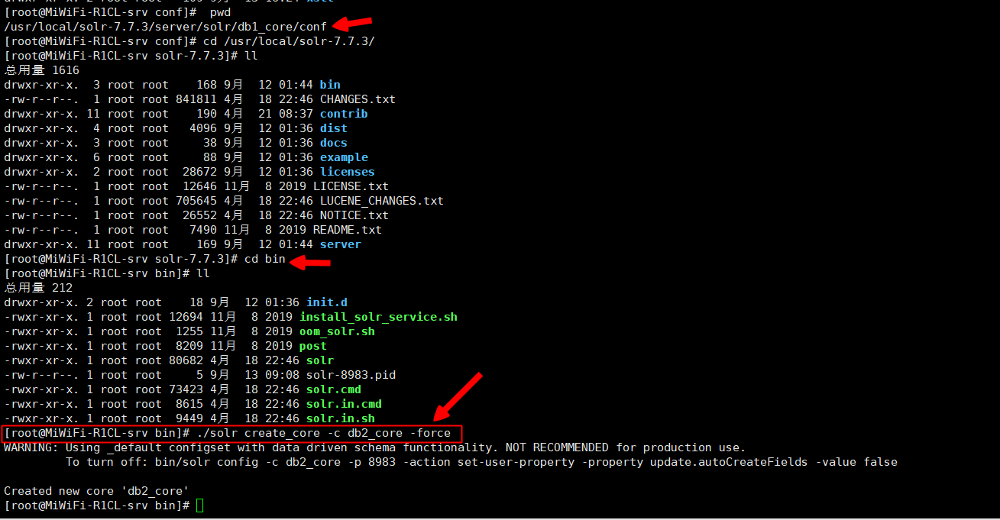
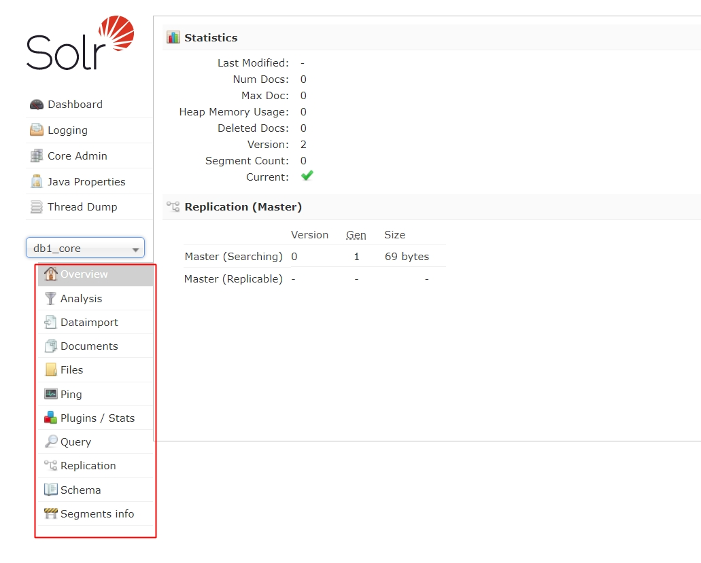
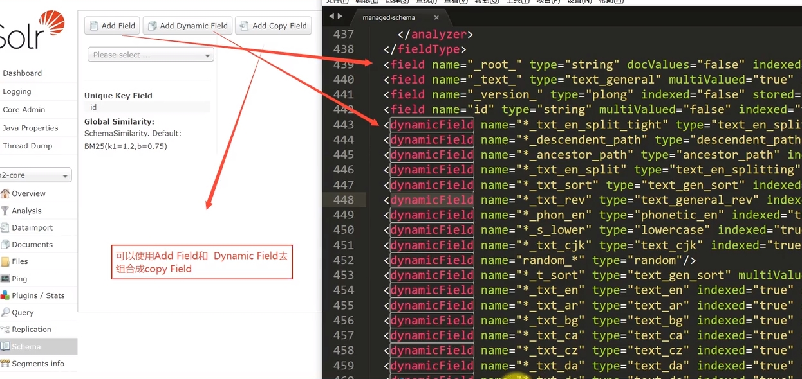

solr学习笔记 

[TOC]


## 一、安装solr
## 二、名词解释

- 索引库
```
导入数据，solr会被它以某种格式保存在索引库里面
```
 
- 索引分词
```
导入数据时对某些语句进行分词
```
- 搜索分词
```
solr在搜索数据库时，会对某些语句进行分词
```
- 文档
```
solr里面搜索出来的某个数据，都是以xml或json来表示
```
- 字段
```
文档里面可能有很多字段，就类似于数据库的字段
```
- solr和数据库对比

  |  mysql  | Solr |
  | :-----: | :--: |
  |         | 索引库  |
  |    表    |  无   |
  |  行 对象   |  文档  |
  | 列 对象的属性 |  字段  |


## 三、 配置文件说明

#### 1.配置文件简介

位置：bin/server/solr

如下图，没有创建索引，都是默认的文件

 

如下是创建一个索引后，主目录的文件结构
```
<solr-home-direrctory>/
  solr.xml
  core_name1/
      core.properties
      conf/
          solfconfig.xml
          managed-sche,a
      data/
  core_name2/
      core.properties
      conf/
          solfconfig.xml
          managed-sche,a
      data/
```

#### 2.solr配置文件
- solor.xml
```
为你的solr服务器实例指定配置选项
```

- 每个solr core
```
core.properties
	为每个核心定义特定的属性
	例如，其名称、核心所属集合、模式的位置、其他参数
solrconfig.xml
	控制高级行为。
	例如，例如你可以为数据目录指定一个备用位置
managed-schema（或者用shema.xml替代）
	描述你将要solr索引的文档。模式将文档定义为字段集合。
	你可以同时
	定义字段类型和字段本身。字段类型定义功能强大，包含有关solr如何传入字段和查询值的信息。
data/
	包含索引文件的目录
```

#### 3.solr索引库说明及创建
索引库类似于mysql的数据库，所以solr必须创建一个索引库才能够使用
有两种方式
1）使用solr管理页面创建（不推荐）


- 属性说明：

name：自定义名字；建议和instanceDir保持一致

instanceDir：实例名字；一般=和name保持一致

dataDir：默认的数据存储目录；一般"data"

config：指定配置文件；db1_core/conf/solfconfig.xml

shcema：指定属性的下xml；db1_core/conf/managed-shema
- 点击添加会报错
   

   解决：
   进入 solr目录，执行命令 =>  cp -r ../configsets/sample_techproducts_configs/* ./
   再点击add core
    


2）使用命令推荐

step1：进入solr的bin目录

step2：执行命令 => ./solr create_core -c db2_core -force

 


## 四、solr控制台介绍

#### 1.主面板
- Dashboard 仪表盘
- Logging 日志
- Core Admin core管理
- Java Properties
#### 2.core主要操作

 
- Analysis 分析器
  可以对查询进行模拟
  Field Value(index)：索引分词
  Filed Value(Query)：查询条件分词
  Analyse FieldType：分词策略
  可选值来源于:conf/managed-schema
  可以手动自己去修改managed-schema

- Schema

地址：solr/db2_core/conf/
注意：db2_core指自己创建的索引库

 

1）添加

2）

3）


